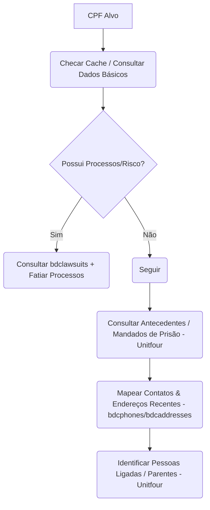

# 🛠️ Instruções de Uso e Boas Práticas — MCP veridianOsint-Conceitual

Este documento serve como manual de instrução do sistema (System Instructions) para guiar Modelos de Linguagem (LLMs) a utilizarem as ferramentas do servidor MCP **veridianOsint-Conceitual** de forma otimizada, econômica e estruturada.

---

## 📌 1. Visão Geral das APIs Habilitadas

O servidor MCP integra 7 fontes principais de dados de inteligência e OSINT:
1. **BigDataCorp**: Consultas cadastrais completas, dados profissionais, fiscais, econômicos, relacionamentos e processos judiciais para PF (CPF) e PJ (CNPJ).
2. **CSINT.pro**: Busca universal de vazamentos (Breach data), IP Lookup e reputação avançada de e-mails/telefones (via SEON).
3. **UnitFour**: Localização cadastral reversa (CEP, Telefone, E-mail, Nome), tomadores de decisão, empresas ligadas, mandados de prisão, antecedentes criminais e proprietários de veículos por placa.
4. **HikerAPI (Instagram)**: OSINT de perfis do Instagram (dados de perfil, posts, stories ativos, seguidores e quem segue).
5. **Harvest API (LinkedIn)**: OSINT de perfis do LinkedIn (extração de perfis, posts, comentários, reações e busca de e-mails atrelados).
6. **Lighthouse/Lampyre (Facebook & Imagens)**: Busca reversa de contas no Facebook (por UID, telefone, e-mail ou username), consultas na Darknet e ferramentas de imagem (reconhecimento facial e geolocalização por foto).
7. **WhoisXML API**: Consulta de dados WHOIS (registro e propriedade) para domínios, endereços IP e extração automática de dados de domínios a partir de e-mails.

---

## ⚡ 2. Regra de Ouro: Gerenciamento Ativo de Cache

Para evitar gastos desnecessários de créditos de API e reduzir o tempo de latência, o servidor intercepta chamadas e salva respostas locais em `cache_consultas/`.

### Fluxo de Validação de Cache para LLMs:
- **Antes de iniciar uma nova chamada complexa**, verifique se o alvo já foi consultado.
- Se você executar a ferramenta principal (ex: `bigdata_consultar_cpf` ou `bigdata_consultar_cnpj`) passando apenas a categoria básica (`bdcbasicdata`/`bdccompanybasicdata`), o servidor interceptará o cache local caso ele já exista e retornará a lista de chaves de categorias disponíveis.
- Se o cache for encontrado (`status: sucesso`), **NUNCA repita a consulta principal**. Em vez disso, utilize as ferramentas de fatiamento (`bigdata_ver_categoria` ou `bigdata_ver_categoria_cnpj`) para buscar os dados das chaves disponíveis.

---

## 📦 3. Prevenção de Estouro de Contexto (Context Window Bloat)

Algumas respostas de consultas completas (como o histórico de processos judiciais de uma pessoa com muitos litígios) podem conter centenas de kilobytes de dados, estourando o contexto da LLM e gerando lentidão.

### Regras de Fatiamento:
- **Não carregue tudo de uma vez**: Evite solicitar múltiplos datasets pesados na mesma chamada inicial se o alvo for muito exposto.
- **Visualização por Categoria**: Use `bigdata_ver_categoria` (para CPF) ou `bigdata_ver_categoria_cnpj` (para CNPJ) especificando o dataset desejado para ler apenas o bloco de dados relevante por vez.
- **Paginação de Cache**: Para analisar dados gigantescos que já estão salvos localmente, utilize a ferramenta `investigador_ler_cache` controlando a paginação com os parâmetros `slice_start` e `slice_end` (ex: navegando de 20 em 20 itens).

---

## 🔄 4. Fluxos de Trabalho Recomendados (Step-by-Step)

### 👤 Fluxo 1: Investigação de Pessoa Física (CPF)

1. **Dados Básicos**: Rode `bigdata_consultar_cpf` ou `unitfour_consultar_cpf` para validar o nome completo, idade, data de nascimento e filiação.
2. **Processos e Risco**: Se houver processos judiciais, utilize `bigdata_ver_categoria` com o código `bdclawsuits` para analisar o histórico processual de forma resumida.
3. **Compliance Criminal**: Rode `unitfour_mandados_prisao` e `unitfour_antecedentes_criminais` para verificar pendências ativas com a justiça.
4. **Histórico Cadastral**: Acesse `bdcphones`, `bdcemails` e `bdcaddresses` para consolidar telefones e endereços atualizados.
5. **Relacionamentos**: Use `unitfour_pessoas_ligadas` para extrair possíveis parentes e sócios.

---

### 🏢 Fluxo 2: Investigação de Pessoa Jurídica (CNPJ)
1. **Dados de Registro**: Consulte os dados cadastrais básicos da empresa com `bigdata_consultar_cnpj` ou `unitfour_consultar_cnpj`.
2. **Quadro de Sócios (QSA)**: Identifique os sócios e tomadores de decisão com `unitfour_tomadores_decisao` ou mapeando a categoria `bdccompanyrelationships` do BigDataCorp.
3. **Evolução de Atividade**: Consulte a saúde e histórico da empresa mês a mês usando `bdccompanyevolution` (ajuste para tratar `CompanyEvolutionData` se necessário).
4. **Investigação Reversa**: Se a empresa estiver baixada ou envolvida em fraudes imobiliárias/financeiras, extraia o CPF dos sócios principais e execute o **Fluxo 1** sobre eles.

---

### 📸 Fluxo 3: Investigação de Redes Sociais e OSINT de Imagens
- **Instagram**: 
  1. Comece sempre com `instagram_buscar_usuario` informando apenas o username para obter o `user_id` (pk).
  2. Use o `user_id` obtido para consultar posts (`instagram_ver_posts`), stories ativos (`instagram_ver_stories`) ou conexões (`instagram_ver_seguidores`).
- **LinkedIn**: 
  1. Busque o perfil pela URL usando `linkedin_buscar_perfil`.
  2. Para buscar e-mails atrelados de forma ativa com validação SMTP, utilize `linkedin_buscar_email_perfil`.
- **Facebook**: 
  1. Utilize buscas reversas por e-mail (`lighthouse_fb_email_restore`) ou telefone (`lighthouse_fb_phone_restore`) para identificar o UID do perfil.
  2. Com o UID em mãos, busque dados do mural (`lighthouse_fb_uid_wall`), amigos (`lighthouse_fb_uid_friends`) e vazamentos na darknet (`lighthouse_fb_uid_darknet`).
- **Imagens**:
  1. Para reconhecimento facial de fotos de suspeitos em bases abertas, use `lighthouse_image_facecheck`.
  2. Para deduzir a geolocalização de fotos, use `lighthouse_image_geolocation`.

---

### 🚗 Fluxo 4: Investigação de Veículos (Placa)
1. Execute `unitfour_proprietario_veiculo_placa` passando a placa sem traços (ex: `ABC1D23`).
2. Colete os dados do proprietário (CPF/CNPJ e Nome).
3. Mapeie o veículo (Renavam, Chassi, Modelo, Ano de Fabricação).
4. Submeta o CPF do proprietário ao **Fluxo 1** para traçar a linha de bens do investigado.

---

### 🌐 Fluxo 5: OSINT de Domínios, IPs e E-mails (WhoisXML API)
1. **Consulta Direta de Domínio ou IP**: Execute `whois_consultar` informando o domínio (ex: `google.com`) ou IP (ex: `8.8.8.8`) para obter dados de propriedade, data de registro, expiração, dados de contato e DNS do alvo.
2. **Investigação a partir de E-mails**: Ao receber um e-mail suspeito, você pode rodar `whois_consultar` fornecendo o e-mail completo. A ferramenta extrairá automaticamente o domínio e retornará a propriedade do domínio em questão.
3. **Evitar Estouro de Contexto**: Mantenha o parâmetro `ignore_raw_text=True` (comportamento padrão) para evitar retornar o texto bruto desestruturado do WHOIS, poupando tokens e mantendo o contexto limpo.
4. **Dados Obrigatórios**: Ao exibir as informações recuperadas para o usuário, garanta que dados fundamentais como **País**, **Estado** (se disponível na resposta) e **Último Update (updatedDate)** sejam destacados na apresentação do resultado.

---

## ⚠️ 6. Tratamento de Erros e Limites de API

- **Erros de Formatação**: CPFs e CNPJs são limpos automaticamente pelo servidor (removendo pontos, barras e traços e completando com zeros à esquerda), mas telefones devem preferencialmente seguir o padrão internacional E.164 (ex: `+5511988887777`).
- **Timeouts do Lighthouse**: Tarefas do Lighthouse envolvem polling assíncrono. Se o servidor retornar timeout, a tarefa pode ainda estar rodando remotamente. Você pode tentar fazer a mesma requisição alguns minutos depois para puxar o resultado final diretamente do cache local.
- **Semáforos**: O servidor gerencia concorrência de chamadas críticas em segundo plano. Não tente paralelizar mais de 3 requisições pesadas ao mesmo tempo para não congestionar as conexões persistentes.
